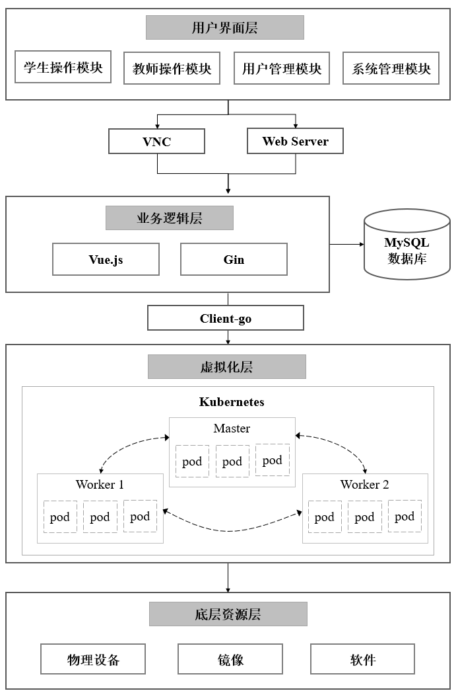
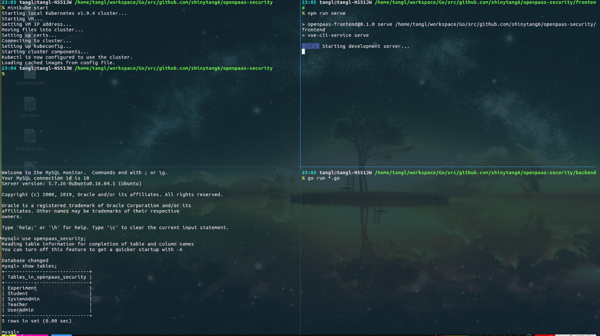

## 网络安全仿真平台

**感谢以下开源项目作者及参与者的无私奉献**
> * [Gin](https://github.com/gin-gonic/gin)
> * [Vue](https://github.com/vuejs/vue)
> * [Vue-cli](https://github.com/vuejs/vue-cli)
> * [Client-go](https://github.com/kubernetes/client-go)
> * 其他相关开源项目

### 简介

一个前后端分离的网络安全仿真平台, 技术栈为vue.js(vue-cli 3.x脚手架生成) + golang(gin) + mysql

### 项目目录结构

```
.
├── backend  后端代码目录
│   ├── apis         控制器代码，定义了各个接口相应的方法
│   ├── database    主要进行mysql数据库的初始化
│   ├── Dockerfile  后端的Docker配置文件
│   ├── main.go     后端服务的启动文件（入口）
│   ├── models      模型相关代码，主要定义了同mysql数据库交互的代码
│   ├── router.go   路由文件，定义了后端接口
│   └── util        效用函数
├── client          本地集群初始化连接
│   └── client.go
├── db.sql          mysql导出文件，可用此文件还原我的mysql database
├── deployment      对集群deployment资源的操作(因为代码逻辑中对集群的操作最上层只涉及deployment和service资源的操作)
│   └── deployment.go
├── docker-compose.yaml  整个项目的docker配置文件
├── docs            文档相关
│   └── docs.md
├── examples        实例配置文件
│   ├── ca
│   ├── dvwa_svc.yaml
│   ├── dvwa.yaml
│   ├── EFK
│   ├── fluentd-es
│   ├── nginx_svc.yaml
│   ├── nginx.yaml
│   ├── pod.yaml
│   ├── test.yaml
│   ├── vnc_svc.yaml
│   └── vnc.yaml
├── frontend        前端代码(这部分都是由vue-cli生成的框架，主体代码在src目录下)
│   ├── babel.config.js
│   ├── dist
│   ├── node_modules
│   ├── package.json  依赖配置文件
│   ├── package-lock.json
│   ├── public
│   ├── README.md
│   ├── src         前端逻辑代码
│   └── vue.config.js   配置文件，这里进行了一个小的修改，就是将前端地址通过代理服务器转发到后端(解决同源跨域问题)
├── main.go    其实没用
├── nginx.conf   nginx代理配置文件，用在docker-compose.yaml中
├── README.md    
├── service  对集群service资源的操作(因为代码逻辑中对集群的操作最上层只涉及deployment和service资源的操作)
│   └── service.go
└── utils    效用函数
    └── utils.go
```

### 系统架构图



### 本地安装&使用
> 仅在ubuntu下测试通过，因此以ubuntu为例进行介绍

#### 开发环境
本地安装需要node, mysql, golang的环境，并且在底层需要搭建起kubernetes集群

**Step 1: Kubernetes集群**

本平台底层基于kubernetes集群而构建，因此在搭建平台前必需构建起kubernetes集群

具体的构建方式非常多，如果用于本地开发则官方建议使用minikube(单节点集群)以及kubeadm-dind(三节点集群)两种搭建方式，关于kubernetes所有相关教程都可以在[官方网站](https://kubernetes.io/docs/tutorials/hello-minikube/)上找到

这里介绍我开发环境下使用最多的集群构建方式minikube。

1. [官网安装介绍](https://kubernetes.io/docs/setup/learning-environment/minikube/#installation)需要自备梯子(是因为组成集群的各个组件是由镜像构建出来的容器，而这些镜像的获取大部分需要梯子)，因此不是很推荐这种方法。
2. 推荐！使用阿里云维护的[安装方案](https://yq.aliyun.com/articles/221687)

根据上述安装指南安装完成minikube，以下为常用的一些命令：
```bash
minikube start // 启动minikube
minikube stop // 停止minikube
minikube dashboard // 打开kubernetes dashboard
minikube ssh // 进入集群虚拟机内部
```

一旦正确启动集群，在命令行下我们主要通过kubectl这个工具对集群进行操作，kubectl的使用同样可以查看[kubernetes官网kubectl的介绍部分](https://kubernetes.io/docs/reference/kubectl/overview/)
可以重点关注以下几个命令(前四个为我开发过程中最常用的命令)：
```bash
kubectl get xxx // xxx是可以是任何集群资源, 如最常见的pod, service, deployment
kubectl create -f xxx// xxx通常为集群配置文件
kubectl delete -f xxx// xxx通常为集群配置文件
kubectl exec -it xxx// xxx通常为集群内创建的某个pod id, 进入该pod内
kubectl run ... // 该命令的作用其实同kubectl create类似，都为创建某资源，但通常使用配置文件的方法更常用
```

**Step 2: 前端环境**

本平台的前端完全基于vue.js创建，构建的方法使用的是脚手架生成工具vue-cli 3.

要运行前端，只需要安装有nodejs的环境，安装指南：[https://nodejs.org/en/download/package-manager/#debian-and-ubuntu-based-linux-distributions-enterprise-linux-fedora-and-snap-packages](https://nodejs.org/en/download/package-manager/#debian-and-ubuntu-based-linux-distributions-enterprise-linux-fedora-and-snap-packages)

安装方式较为简单，安装完成可输入以下命令验证(版本>=我的版本即可)
```bash
$ npm -v
6.7.0
$ node -v
v11.12.0
```

**Step 3: 后端环境**

下载并安装go语言,配置环境变量, 安装指南： [https://golang.google.cn/doc/install](https://golang.google.cn/doc/install)

查看是否安装成功：可输入go version查看go版本
安装方式较为简单，安装完成可输入以下命令验证(版本>=我的版本即可)
```bash
$ go version
go version go1.11 linux/amd64
```

**Step 4: Mysql**

参考各类安装教程, 如ubuntu下通过下面三条命令安装即可
```bash
sudo apt-get install mysql-server
sudo apt-get isntall mysql-client
sudo apt-get install libmysqlclient-dev
```

#### 本地运行步骤

1. 克隆项目到本地
```
go get github.com/shinytang6/openpaas-security
下载完成项目会存在于$GOPATH/src/github.com/shinytang6目录下
ps: 如果使用git clone推荐将项目直接克隆到$GOPATH/src/github.com/shinytang6下,这是golang常见开发习惯
 ```  
2. 启动集群
```
minikube start
``` 
3. 导入mysql数据
```
# 进入本地mysql
mysql -u xxx -p
create database abc;(创建数据库)
show databases;(就可看到所有已经存在的数据库，以及刚刚创建的数据库abc)
use abc;(进入abc数据库下面)
show tables;(产看abc数据库下面的所有表,空的)
source GOPATH/src/github.com/shinytang6/openpaas-security/db.sql（导入数据库表）
show tables;(查看abc数据库下面的所有表,就可以看到表了)

更详细步骤可参考: https://blog.csdn.net/u012160319/article/details/81111289
```    
    
4. 启动前端
```
cd $GOPATH/src/github.com/shinytang6/openpaas-security/frontend
首先根据上一步得到的集群相应修改frontend/.env.development配置文件中的集群地址, 如果集群启动方式为minikube则通常无需修改
如果首次启动安装依赖运行 npm install
启动命令为npm run serve(其他相关命令可查看frontend/README文件)
```
5. 启动后端
```
cd $GOPATH/src/github.com/shinytang6/openpaas-security/backend
go run *.go
```    

完成上述步骤基本就可以完整地启动整个平台了！

完整的启动效果图如下：



默认帐号如下：
```
学生帐号 & 密码：
    student1 123456
    student2 123456
    student2 123456
教师帐号 & 密码：
    teacher1 123456
    teacher2 123456
用户管理帐号 & 密码：
    userAdmin 123456
系统管理帐号 & 密码：
    sysAdmin 123456
```    

#### Docker Compose部署步骤

1. 下载docker-compose命令

2. 一键启动
```
cd $GOPATH/src/github.com/shinytang6/openpaas-security/
docker-compose up -d
``` 
    
3. 导入表
```
mysql -h x.x.x.x -u root -p(要想同步数据，仍然需要按照上述步骤手动导入表)
```

这种方法可以实现一键部署，可以直接部署在集群任意节点上并对外提供服务